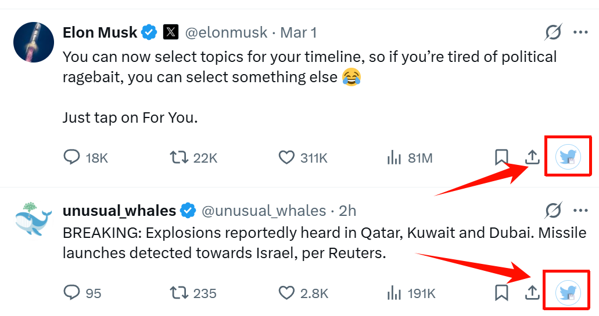
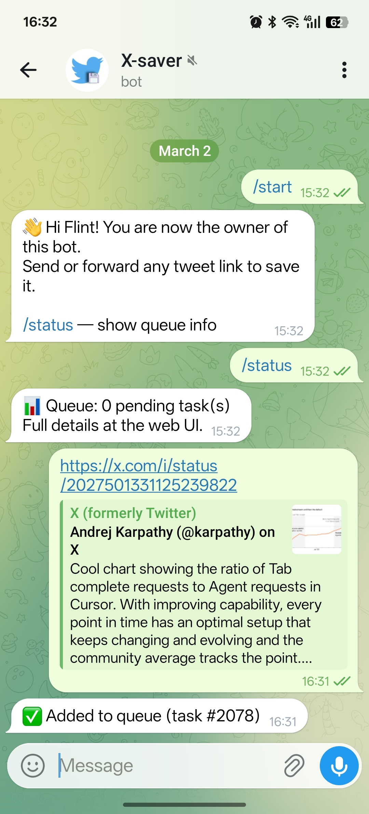

<div align="center">
  
</div>

# OmniSaver — Multi-Platform Content Archiver

A self-hosted content saver for your NAS, home server, or Raspberry Pi. Archive tweets, YouTube videos, XiaoHongShu (小红书) posts, WeChat articles, and any webpage — including images and videos — to local storage with one click.

  

[中文文档](README.zh-CN.md)

---

## ✨ Features

- Self-hosted — runs on any Linux box, NAS, or Raspberry Pi
- No Twitter API key required — uses Playwright browser automation
- **Multi-platform support:**
  - **Twitter/X** — save tweets, full threads, long-form articles, and videos
  - **YouTube** — save video metadata, subtitles, and channel info
  - **Douyin (抖音) / TikTok** — save videos without watermarks via Playwright (no cookies needed)
  - **XiaoHongShu (小红书)** — save image posts and videos via Telegram bot or REST API
  - **WeChat articles (微信公众号)** — save articles with images and formatting
  - **Any webpage** — Pocket-style read-it-later for any `http/https` URL; uses Firefox Reader Mode algorithm (Mozilla Readability.js) to extract clean article content with images
- **Full Twitter thread fetching** — when Twitter credentials are configured, entire reply chains are saved as a single archive with all media embedded inline
- **Twitter long-form articles** — automatically detects and saves full article content from `/status/` URLs
- **Twitter video downloads** — downloads videos via yt-dlp; authenticated downloads supported when credentials are configured
- **Douyin/TikTok Native Scraper** — uses Playwright to bypass API restrictions and fetch unwatermarked videos directly from the original source
- Unified URL input — paste any supported URL on the homepage; content type is auto-detected
- Tampermonkey userscript adds save buttons on Twitter/X tweets and YouTube video pages/thumbnails
- Saves content in multiple formats: plain text, Markdown, Reader-mode HTML
- Saves complete metadata (author, timestamp, stats) as JSON
- Built-in task queue with automatic retry on failure (exponential backoff)
- **Redownload tasks** — manually trigger a full redownload for any task directly from the Tasks page
- Web UI with real-time log streaming, task monitoring, and content browsing
- Saved page shows a platform badge (X, YouTube, Douyin, 小红书, WeChat, or 🌐 Web) on each card
- **YouTube descriptions with clickable links** — bare URLs in video descriptions are automatically rendered as hyperlinks in the viewer
- **Enhanced search:** full-text search across content and article titles; filter by platform (multi-select), date range (quick presets or custom); all filters combine
- Supports infinite scroll and pagination (toggle per preference)
- Each archived post gets a unique public share link (`/view/<slug>`)
- Change password via the in-app user menu
- Optional: Telegram bot — save content from any supported platform by forwarding links
- Optional: AI-powered tag generation via Gemini API
- Optional: video thumbnails via FFmpeg

---

## 🚀 Quick Start

**Prerequisites:** Python 3.7+.

- **yt-dlp** — required for Twitter/X and XiaoHongShu video downloads: `pip install yt-dlp` or follow [yt-dlp install guide](https://github.com/yt-dlp/yt-dlp#installation)
- **FFmpeg** — optional, for video thumbnails

```bash
# 1. Clone the repository
git clone https://github.com/yelosheng/omnisaver.git
cd omnisaver

# 2. Install Python dependencies
pip install -r requirements.txt

# 3. Install Playwright browser (required)
python -m playwright install chromium

# 4. Copy and edit the config file
cp config.ini.example config.ini
```

### Web UI

```bash
python run_web.py
```

Open `http://localhost:6201` in your browser. Default login: `admin` / `admin`.

> **Change the default password immediately after first login:** click the user menu (top-right) → **Change Password**.

### Docker (Recommended for NAS / Home Server)

Docker is the easiest deployment method. yt-dlp and FFmpeg are included in the image.

```bash
# 1. Clone the repository
git clone https://github.com/yelosheng/omnisaver.git
cd omnisaver

# 2. Copy config
cp config.ini.example config.ini

# 3. Build and start
docker compose up -d

# 4. Open http://localhost:6201
```

All data (database, saved content, user credentials) is stored in `./docker-data/` on your host machine and persists across container restarts and rebuilds.

> **Note:** The first build takes several minutes — Playwright downloads Chromium (~200 MB) and yt-dlp is fetched during the build.

**Custom port or save path** — edit `docker-compose.yml` before starting:

```yaml
ports:
  - "8080:6201"          # change left side to use a different host port
volumes:
  - /mnt/nas/twitter:/app/saved_tweets  # point to your NAS or external drive
```

---

## 🖱️ Browser Extension (Tampermonkey) — Best for Desktop

The most convenient way to save content on a desktop browser. A Tampermonkey userscript injects a **save button** directly below each tweet on Twitter/X and on YouTube video pages. On the YouTube homepage, a save icon appears on video thumbnails on hover.



**Install:**
1. Install the [Tampermonkey](https://www.tampermonkey.net/) browser extension (Chrome, Firefox, Edge, or Safari)
2. Start the web UI: `python run_web.py`
3. Visit `http://localhost:6201/help` and click the install link — Tampermonkey will open a confirmation dialog
4. Click **Install** — the save button now appears on every tweet automatically

**Configure the backend URL** (required the first time, or when your server address changes):
- Click the Tampermonkey icon in your browser toolbar
- Find the **Twitter/X Archiver Save Button** script and click the settings icon
- Click **⚙️ 设置后端地址**, then enter your server address

If the server runs on the same machine as your browser, the default `http://localhost:6201` works out of the box. For a home server or NAS, use its local IP, e.g. `http://192.168.1.100:6201`.

The script file is at `tampermonkey/twitter-saver.user.js`.

---

## 🔑 Twitter/X Credentials (Optional — Enables Full Thread Fetching)

By default, the tool uses Playwright browser automation for scraping. Configuring Twitter cookies enables **xreach** — a faster scraper that fetches complete reply threads and supports authenticated video downloads.

**What credentials unlock:**
- Full thread fetching — entire self-reply chains saved as a single archive
- Authenticated video downloads via yt-dlp
- Faster scraping for single tweets

**Setup (via web UI):**
1. Log in to [x.com](https://x.com) in your browser
2. Install [Cookie-Editor](https://cookie-editor.cgagnier.ca/) browser extension
3. On x.com, click the Cookie-Editor icon → **Export** → **Export as JSON** → copy
4. In the web UI, go to **Settings** → **Twitter/X Credentials** → paste the JSON → **Save**

The tool extracts `auth_token` and `ct0` from the JSON and stores them in `config.ini`. Credentials persist across restarts.

> **Note:** Twitter sessions expire after weeks or months. If thread fetching stops working, repeat the cookie export and re-paste in Settings.

---

## 🤖 Telegram Bot — Best for Mobile

The most convenient way to save tweets on a phone or tablet. Share any tweet directly to your private Telegram bot using the native Twitter/X share sheet — no URL copying, no app switching.



**Setup:**
1. Open [@BotFather](https://t.me/BotFather) on Telegram, send `/newbot`, follow the prompts, and copy the bot token
2. In the web UI, go to `/telegram`, paste the token, and click **Save & Start Bot**
3. Open your new bot in Telegram and send `/start` — the first person to do this becomes the permanent owner; only the owner can trigger saves
4. The bot is now ready — send or forward any `twitter.com` / `x.com` link to it and it will reply with a task ID and start saving immediately

**On mobile (the main use case):**
1. Open a tweet in the Twitter/X app
2. Tap the **Share** icon → **Share via...** → select your Telegram bot from the contact list
3. The bot receives the link and queues the download — you get a confirmation reply

**Bot commands:**
- Any message containing a Twitter/X URL → queued for archiving
- Any message containing a YouTube URL → queued for archiving
- Any message containing a XiaoHongShu URL → saved immediately (see XHS section below)
- Any message containing a WeChat article URL → queued for archiving
- `/status` — shows current queue size

---

## 📕 XiaoHongShu (小红书) Integration

XHS support is powered by [agent-reach](https://github.com/Panniantong/agent-reach) and its `xiaohongshu-mcp` Docker container. Once configured, you can save any XHS post by forwarding the link to the Telegram bot or calling the REST API.

### Prerequisites

- Docker
- Node.js (for `mcporter` and `yt-dlp` via npm)

### Setup

**1. Install agent-reach**

```bash
npm install -g agent-reach
agent-reach install
```

**2. Start the XiaoHongShu MCP server**

```bash
# Pull and start the container (cookies volume-mounted for persistence)
mkdir -p ~/.agent-reach/xhs
docker run -d --name xiaohongshu-mcp \
  -p 18060:18060 \
  -v ~/.agent-reach/xhs/cookies.json:/app/cookies.json \
  xpzouying/xiaohongshu-mcp
```

**3. Configure cookies (login required)**

Log in to xiaohongshu.com in your browser, export cookies using [Cookie-Editor](https://cookie-editor.cgagnier.ca/) (JSON format), then:

```bash
agent-reach configure xhs-cookies
# Paste the JSON cookie string when prompted
# Then copy it into the container's expected path:
docker exec xiaohongshu-mcp cp /cookies.json /app/cookies.json
```

**4. Register the server globally**

Add to `~/.mcporter/mcporter.json`:

```json
{
  "mcpServers": {
    "xiaohongshu": { "baseUrl": "http://localhost:18060/mcp" }
  }
}
```

**5. Verify**

```bash
mcporter call 'xiaohongshu.search_feeds(keyword: "test")'
```

### Saving XHS Posts

**Via Telegram bot** — forward or paste any `xiaohongshu.com/explore/...?xsec_token=...` URL. The bot replies with the title, type, file count, and a `/view/<slug>` link.

**Via REST API:**

```bash
curl -X POST http://localhost:6201/api/submit/xhs \
  -H "Content-Type: application/json" \
  -d '{"url": "https://www.xiaohongshu.com/explore/<id>?xsec_token=<token>"}'
```

### XHS Output Structure

```
saved_xhs/
└── 2024-01-15_Post-Title_feedid/
    ├── content.txt        # Plain text description
    ├── content.md         # Markdown with author info and stats
    ├── metadata.json      # Full API response (no comments)
    ├── avatar.jpg         # Author profile picture
    ├── images/            # Image posts: 01.webp, 02.webp, …
    ├── videos/            # Video posts: <title>.mp4
    └── thumbnails/        # Video cover image
```

> **Note:** Cookies expire periodically. Re-run the configure step and restart the container when XHS calls start failing.

---

## 🎬 YouTube Integration

Save YouTube videos — metadata, subtitles, and channel info are archived automatically.

### Saving YouTube Videos

**Via Web UI** — paste any YouTube URL into the homepage input field. Supported formats:
```
https://www.youtube.com/watch?v=VIDEO_ID
https://youtu.be/VIDEO_ID
https://www.youtube.com/shorts/VIDEO_ID
```

**Via Tampermonkey userscript** — on any YouTube watch page, a save button appears in the action bar. On the homepage, a save icon appears on each video thumbnail on hover.

**Via Telegram bot** — send or forward any YouTube link.

**Via REST API:**
```bash
curl -X POST http://localhost:6201/api/submit/youtube \
  -H "Content-Type: application/json" \
  -d '{"url": "https://www.youtube.com/watch?v=VIDEO_ID"}'
```

### YouTube Settings

Go to `/settings` in the web UI to configure an optional **YouTube Data API key** (used for fetching channel avatars). Get a free key at [Google Cloud Console](https://console.cloud.google.com) → Enable "YouTube Data API v3" → Credentials → API Key.

---

## 🌐 Web Page Read-It-Later

Save any article or webpage for offline reading — works like Pocket or Instapaper.

### Saving Web Pages

**Via Web UI** — paste any `http://` or `https://` URL into the homepage input field.

**Via Telegram bot** — send any webpage link that isn't XHS/WeChat/YouTube/Twitter.

**Via REST API:**
```bash
curl -X POST http://localhost:6201/api/submit \
  -H "Content-Type: application/json" \
  -d '{"url": "https://example.com/article"}'
```

### How It Works

Uses Playwright to render the page (executes JavaScript, triggers lazy-loaded images), then runs **Mozilla Readability.js** — the same algorithm as Firefox Reader Mode — to extract clean article content. Images are downloaded locally.

### Web Page Output Structure

```
saved_tweets/
└── YYYY/MM/YYYY-MM-DD_title_hash/
    ├── content.html       # Reader-mode HTML with inline images
    ├── content.txt        # Plain text
    ├── content.md         # Markdown with metadata header
    ├── metadata.json      # Title, author, sitename, published date, source URL
    └── images/            # Downloaded images
```

---

## 📰 WeChat Article Integration

Save WeChat public account articles (微信公众号文章) with full text, images, and formatting.

### Saving WeChat Articles

**Via Web UI** — paste any WeChat article URL into the homepage input field.

**Via Telegram bot** — send or forward any `mp.weixin.qq.com` link.

**Via REST API:**
```bash
curl -X POST http://localhost:6201/api/submit/wechat \
  -H "Content-Type: application/json" \
  -d '{"url": "https://mp.weixin.qq.com/s/ARTICLE_ID"}'
```

### WeChat Output Structure

```
saved_wechat/
└── YYYY/MM/YYYY-MM-DD_article_id/
    ├── content.txt        # Plain text
    ├── content.md         # Markdown with title, author, publish time
    ├── metadata.json      # Article metadata
    ├── images/            # Embedded images
    └── videos/            # Embedded videos (if any)
```

---

## ⚙️ Configuration

Copy `config.ini.example` to `config.ini` and edit as needed.

| Option | Description | Default |
|---|---|---|
| `[storage] base_path` | Directory where tweets are saved | `./saved_tweets` |
| `[storage] create_date_folders` | Create date-based subfolders | `true` |
| `[download] max_retries` | Max retry attempts on download failure | `3` |
| `[download] timeout_seconds` | Request timeout in seconds | `30` |
| `[scraper] use_playwright` | Use Playwright browser automation (recommended) | `true` |
| `[scraper] headless` | Run browser in headless mode | `true` |
| `[scraper] debug_mode` | Save screenshots on errors | `false` |
| `[twitter] auth_token` | Twitter `auth_token` cookie (optional, enables xreach thread fetching) | unset |
| `[twitter] ct0` | Twitter `ct0` cookie (required together with `auth_token`) | unset |
| `[ai] gemini_api_key` | Gemini API key (optional, for AI tags) | unset |
| `[ai] youtube_api_key` | YouTube Data API v3 key (optional, for channel avatars) | unset |
| `[telegram] bot_token` | Telegram bot token (optional, for Telegram integration) | unset |

**Environment variable overrides:**

| Variable | Description |
|---|---|
| `SAVE_PATH` | Override save path |
| `USE_PLAYWRIGHT` | Override Playwright toggle |
| `PLAYWRIGHT_HEADLESS` | Override headless mode |
| `PLAYWRIGHT_DEBUG` | Set to `true` to enable debug screenshots |
| `SSL_CERT_PATH` / `SSL_KEY_PATH` | Enable HTTPS |

---

## 📖 Usage

### Web Interface

Visit `http://localhost:6201` after starting.

| Route | Purpose |
|---|---|
| `/` | Submit any supported URL to start archiving (auto-detects platform) |
| `/tasks` | View task queue status |
| `/saved` | Browse and search all archived content (Twitter, YouTube, XHS, WeChat, Web) |
| `/tags` | Manage AI-generated tags |
| `/retries` | View failed tasks and retry manually |
| `/view/<slug>` | View any archived post via share link |
| `/debug` | System status and stuck task reset |
| `/telegram` | Telegram bot configuration |
| `/settings` | YouTube API key and XHS auto-save configuration |
| `/help` | Tampermonkey script installation guide |
| `POST /api/submit` | Submit any URL — platform is auto-detected (JSON body: `{"url": "..."}`) |
| `POST /api/submit/xhs` | Submit a XiaoHongShu URL (JSON body: `{"url": "..."}`) |
| `POST /api/submit/youtube` | Submit a YouTube URL (JSON body: `{"url": "..."}`) |
| `POST /api/submit/wechat` | Submit a WeChat article URL (JSON body: `{"url": "..."}`) |

### CLI

```bash
# Archive a single tweet
python main.py https://x.com/username/status/1234567890

# Skip media downloads
python main.py https://x.com/username/status/1234567890 --no-media

# Specify output directory
python main.py https://x.com/username/status/1234567890 --output /path/to/save

# Show verbose output
python main.py https://x.com/username/status/1234567890 --verbose
```

**Supported URL formats:**
```
https://twitter.com/username/status/1234567890
https://x.com/username/status/1234567890
https://mobile.twitter.com/username/status/1234567890
https://m.twitter.com/username/status/1234567890
```

---

## 📁 Output Structure

```
saved_tweets/
└── 2024-01-15_1234567890123456789/
    ├── content.txt        # Plain text
    ├── content.html       # Reader-mode HTML
    ├── content.md         # Markdown
    ├── metadata.json      # Full metadata (author, timestamp, etc.)
    ├── avatar.jpg         # Author avatar
    ├── images/
    ├── videos/
    └── thumbnails/        # Video thumbnails (requires FFmpeg)
```

---

## 🏷️ AI Tag Generation (Optional)

Automatically generates semantic tags after each successful archive to aid categorization and search. Priority order:

1. **Gemini API** — set `gemini_api_key` in `config.ini` (recommended; generous free tier).
2. **Rule-based** — no API key required; uses built-in keyword rules for basic tagging.

Manage tags on the `/tags` page, or trigger generation for individual items on the `/saved` page.

---

## 🔧 Troubleshooting

**Tweet not found** — The tweet may have been deleted or made private. Verify the URL is correct and accessible in a regular browser.

**Playwright browser not installed** — Run `python -m playwright install chromium`.

**Network issues** — Check your connection and firewall. If Twitter/X is blocked in your region, configure a proxy before using this tool.

**File permission errors** — Ensure write permission on the `base_path` directory and that sufficient disk space is available.

**Tasks stuck in processing** — Visit `/debug` in the web UI and use the "Reset Stuck Tasks" function.

**Enable debug mode** — Set `debug_mode = true` in `config.ini` or `PLAYWRIGHT_DEBUG=true`. Error screenshots will be saved in the project root.

---

## ⚠️ Disclaimer

- **For personal archival use only.** This tool is intended for saving publicly available content for offline reading and personal research.
- **Comply with platform Terms of Service.** Users are solely responsible for their usage and its legal compliance. See [Twitter/X ToS](https://twitter.com/en/tos), [YouTube ToS](https://www.youtube.com/t/terms), and respective platform terms.
- **No commercial use or mass scraping.** Do not use this tool for commercial purposes, bulk data collection, ML training, or any form of mass scraping.
- **Respect copyright.** All content belongs to its original authors. Do not republish or redistribute without authorization.
- **No liability for misuse.** The author accepts no liability for any legal issues, account suspensions, or other consequences arising from misuse.

---

## 📄 License

MIT — see [LICENSE](LICENSE).

---

## 🤝 Contributing

Bug reports, feature requests, and pull requests are welcome. Please ensure existing tests pass before submitting:

```bash
python -m pytest tests/
```
