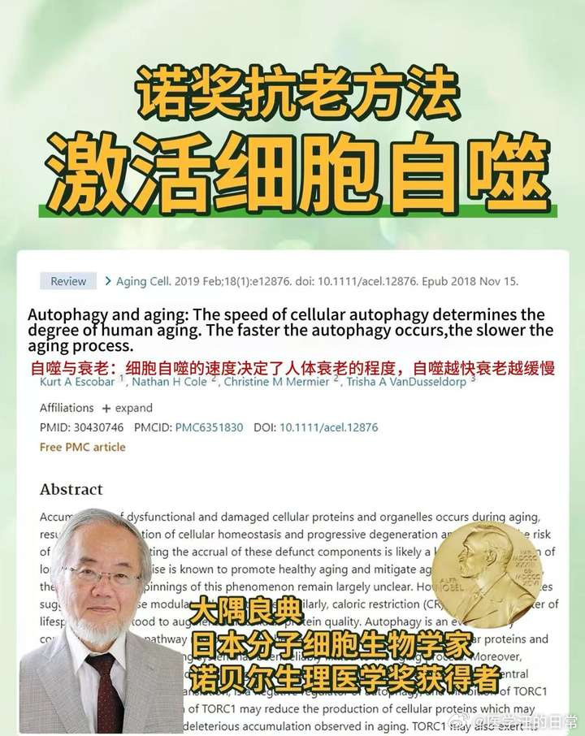
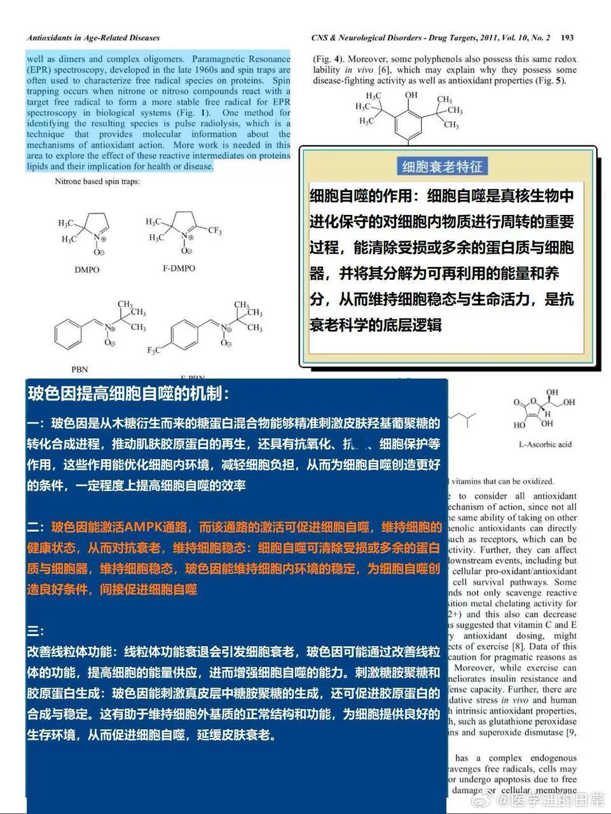
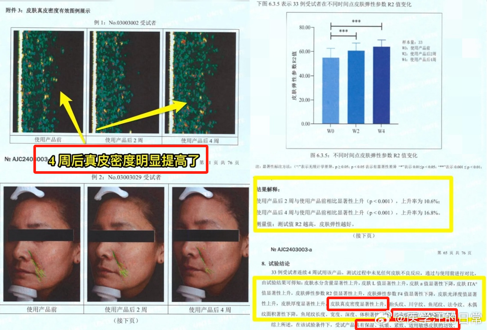
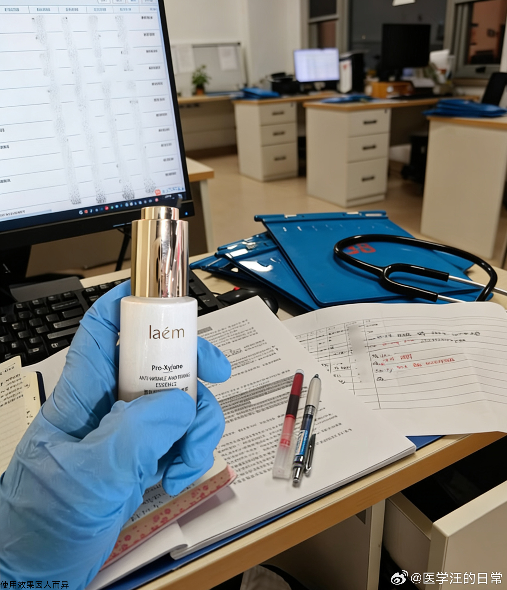
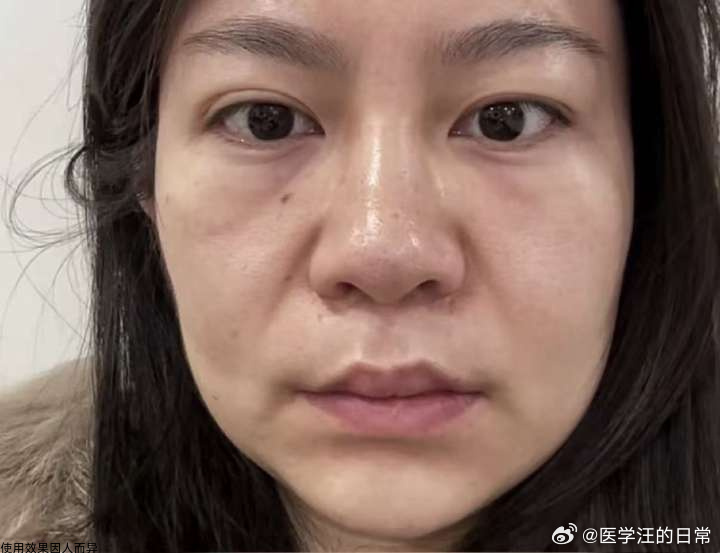
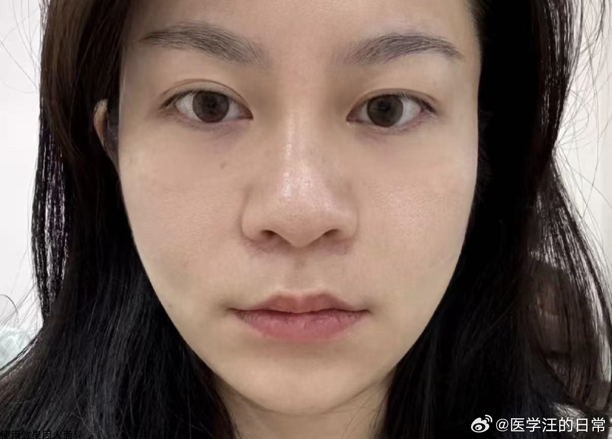

# Weibo Post by 医学汪的日常

**作者**: 医学汪的日常  
**发布时间**: Thu Mar 05 10:40:52 +0800 2026  
**来源**: https://weibo.com/7989112535/5273057976647730  

---

从专业角度，抗老最低成本是多少？#法令纹# 

超过500块的，都是营销费！！
去拿个小分子激活剂（高浓度型的）
不到40天，法令纹，眼角纹都能淡掉
作为C9院校的皮肤学博士，今天就告诉大家一个真相：抗老这件事，根本不用砸钱硬刚。我姐就是活例子。四十多岁的人了，别人都以为她30岁。真的，不夸张。

先说说为什么很多人咬牙买了大几千的面霜，涂了个寂寞？
因为你搞错了对象！你的脸不是你花钱就能直接“修”的，你得请动你身体里那个最牛掰、还免费的“清道夫”——细胞自噬。

别一听专业词就划走，我给你说人话。
细胞自噬，就是你的细胞“自己吃掉自己”。它专门吃掉那些老化的、没用的、让你垮脸的破胶原蛋白碎片。

你想啊，那些旧的胶原蛋白都“老”了，还赖在脸上不走，又松又垮，新来的胶原蛋白根本没地儿站。脸不就塌了吗？

2016年，有个叫大隅良典的日 本人，就凭发现这个细胞自噬原理，拿了诺贝尔奖（详细见图一）

那么问题来了，怎么唤醒细胞的自噬能力？（详细见图二三）
2024年，哈佛大学的David sinclair教授在皮肤学学会上展示的研究证实：
二列酵母和玻色因复配能显著促进细胞自噬的速度，减少受损细胞的堆积。

在人体功效实验中，激活皮肤细胞自噬后，皮肤中原胶原蛋白浓度增加85.3% ，法令纹淡化改善92.1% ！

我姐的法令纹，我就是用这两种成分复配的原液改善的线下同款 有效抗老 淡化法令纹
说下我姐涂了40天的变化吧

●刚开始的两个星期看不出什么变化，只是会觉得皮肤状态好一些，细腻一些
●涂完大半瓶的时候，纹路虽然还在，但底下的皮肤好像被撑起来了一点，纹路变浅了
●坚持一个多月，法令纹、法令纹就不明显了，眼角的小细纹也几乎看不见了
不是动刀那种改变，是皮肤嘭起来后，纹路淡了，整个人显得舒展、年轻，拍照不用刻意找角度了
（详细见图五六）

之所以改变这么明显，主要得益于这里面的功效成分
①9%玻色因溶液：这是激活自噬的“启动钥匙”，含量足够，才能不玩虚的。
②二裂酵母：这玩意是给自噬机制“踩油门”的，加速清空老废细胞，给新细胞腾地儿。
③人胶原蛋白：老细胞被清走了，新的得赶紧顶上，它就是现成的“建筑材料”。

三个成分打配合，一个负责唤醒自噬细胞，一个负责催它干活，一个负责重建家园，让皮肤从里到外嘭起来。

总结来说，有任何皮肤和身体问题一定要求助专业人士，开的东西都是针对性成分，便宜又高效，没有什C么噱头和无用的添加

对于我们这种天天跟皮肤底层逻辑打交道的专业人来说，抗老就是个“信息差游戏”。
最低成本的抗老，就是相信科学，用对成分，激活你身体里那个自噬细胞。
你知道了“细胞自噬”这四个字，就等于戳破了那些几千块面霜的泡沫。

抗老，真没营销号宣传的那么复杂...

————
评论私信太多回复不过来了，我没法提供任何这个小分子激活剂的私人购买渠道，职业不允许
真有需要的，我最多给个官网链接线下同款 有效抗老 淡化法令纹自己去咨询吧

\#抗老##抗衰#抗衰超话#衰老##法令纹##改善皱纹##眼角纹##科普#

---
**图片**:

